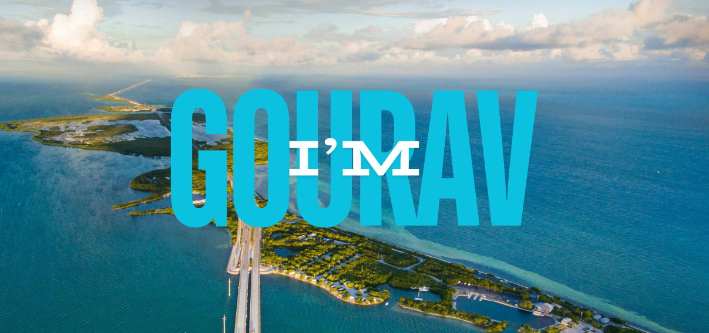

<!---
GT0SRT/GT0SRT is a ✨ special ✨ repository because its `README.md` (this file) appears on your GitHub profile.
You can click the Preview link to take a look at your changes.
--->

  

<!-- 
 
  
<h2>🐍 Contributions 🐍</h2
  

 
# 👋 **Hi, I’m GOURAV** -->

<!--owl image-->
<!-- 

  

- 🔭 I’m currently Learning Machine Learning.
- 👀 I’m interested in Data Science and Machine Learning.
- 🌱 I’m currently Diving Deep into data structure and algorithms.
- 💬 Ask me about Web Development,DSA, computer science.
- 🌱 I’m passionate about Developing inovation's.
- 🏆 I'm striving to increase my GitHub stats rating by contributing to open source. -->

A pre-final year CS undergrad who loves bridging the gap between scalable full-stack architectures and intelligent AI models. When I'm not writing code, I'm probably fine-tuning my manual camera settings or reading historical fiction.

  

 **Engineering:** Architecting robust web platforms using the PERN/MERN stack, FastAPI, and TypeScript.

 **Experimenting:** Deep diving into LLMs, RAG pipelines, and PyTorch.

 **Competing:** Actively building in hackathons (recent Top 3 Regional finish!) and grinding problem-solving on competitive programming platforms.

 **Currently Building:** AI-governed and smart recruitment environments.

 **Ask me about:** system design, AI integration, or philosophy.

<!--Profile Count Badge-->

  

## My Tech Stack

## Github Trophies

<!--Github stats Table--> 
<h2 align="center"> Github Stats </h2>

<table width="100%">
  <tr>
     <td width="20%">
      <h3 align="center"><strong>Github Stats</strong></h3>
      

        
      

    </td>
    <td width="20%">
      <h3 align="center"><strong>Streak Stats</strong></h3>
      

        
         

    </td>
  </tr>
  </table>
 

<!--Contribution Graph-->
## Contribution Graph

## My Contributions and Badges

<!-- leet code -->
<h2 align="center">Leetcode Info</h2>

  

## 🤝 Connect with me:

 &nbsp;
 &nbsp;
